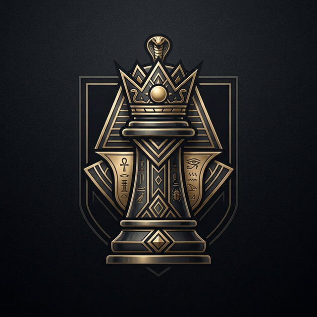

<p align="center">
  
</p>

<h1 align="center">KishMat</h1>

<p align="center">
  <b>The world's first Egyptian Arab chess engine.</b><br/>
  Written entirely in Rust. NNUE-ready, multi-protocol, tournament-ready.
</p>

<p align="center">
  <a href="#features"></a>
  <a href="License.md"></a>
  <a href="#search"></a>
  <a href="#protocol"></a>
  <a href="#evaluation"></a>
  <a href="#gui"></a>
</p>

<p align="center">
  <a href="#quick-start">Quick Start</a> ·
  <a href="#features">Features</a> ·
  <a href="#gui">GUI</a> ·
  <a href="#architecture">Architecture</a> ·
  <a href="#benchmarks">Benchmarks</a> ·
  <a href="#uci-options">UCI Options</a> ·
  <a href="#development">Development</a>
</p>

---

## What's New in v2.0.0

- **Fully Modular Workspace** — Each logical component is its own crate under `crates/`, enabling partial updates and LEGO-like swappability
- **GUI Application** — Native chess GUI built with [iced 0.14](https://iced.rs) featuring a Nova-inspired custom title bar, 8 board themes spanning the entire GUI, pharaonic backgrounds, and high-fidelity image pieces
- **🎨 8 Board Themes** — Classic, Emerald, Ocean, Royal, Walnut, Midnight, Forest, Sakura — each controls all GUI colors (sidebar, panel, accent, text)
- **🪙 Coin Flip** — Animated coin flip to determine which player gets White in Human vs Engine mode
- **🎵 Background Music** — Procedurally generated Arabian/Hijaz-inspired ambient loop (100% royalty-free), with toggle control and 3 moods (Playful, Joyful, Mystique)
- **🏛️ Pharaonic Pattern** — Egyptian-inspired geometric background with gold diamonds, lotus petals, and chevron friezes
- **✨ Capture Animations** — Enhanced capture effects with white flash overlay and scale-up-then-fade animation
- **📷 GIF Export** — Export any game as an animated GIF with full PNG chess piece rendering
- **🔴 Screen Recording** — Cross-platform screen capture (macOS/Windows/Linux) with ffmpeg MP4 or GIF fallback
- **📸 Screenshot** — One-click board screenshot button in the title bar
- **♟️ Premoves** — Enable/disable premoves from the settings panel (on by default)
- **♜ Chess Notation** — Move list shows check (+) and checkmate (#) symbols
- **💾 Settings Persistence** — All GUI settings saved to TOML and auto-restored on launch
- **🔧 Custom Title Bar** — Nova Editor-inspired title bar with pill-shaped action buttons, window dragging, 7px rounded window corners
- **Batch Updater** — GitHub-release-based updater (`kishmat-updater`) with per-component updates, progress bars, and SHA256 verification
- **NNUE Evaluation** — 768→1024×2→1 perspective network with SCReLU and king buckets (Akimbo-compatible ~6 MB net.bin, compiled into binary) — active in search via hybrid eval
- **Classical Evaluation** — Tapered PeSTO PSQT, mobility, king safety, passed pawns, threats, space control
- **Stockfish/Akimbo-Inspired Search** — Razoring, futility, LMR, LMP, null-move with anti-recursion, per-path singular extensions, correction history
- **Benchmarker Crate** — Standalone `kishmat-benchmarker` binary with CLI + TUI, internal + external UCI engine benchmarking
- **XBoard/CECP Protocol** — Full support for WinBoard and XBoard GUIs
- **Opening Book** — Embedded Polyglot gambit-focused opening book
- **Cross-Platform Installer** — `just install` creates a macOS .app bundle, Linux .desktop entry, or Windows Start Menu shortcut
- **Zero-Cost Modularity** — `lto = "fat"` + `codegen-units = 1` ensures full cross-crate inlining in release builds

---

## Quick Start

```bash
git clone https://github.com/theHamdiz/kishmat.git
cd kishmat
```

### Using [just](https://just.systems) (recommended)

```bash
just release     # Build optimized engine binary
just ui          # Build and launch the GUI
just install     # Install as native app (macOS .app, Linux .desktop, Windows shortcut)
just test        # Run all tests
just bench       # Run ELO benchmark suite
```

### Using cargo directly

```bash
# Build the engine
RUSTFLAGS="-C target-cpu=native" cargo build --release

# Run in UCI mode (connects to any UCI-compatible GUI)
./target/release/kishmat uci

# Run in XBoard/CECP mode
./target/release/kishmat xboard

# Play interactively from the terminal
./target/release/kishmat play -d 8

# Launch the GUI
cargo run --release -p kishmat-ui

# Run the benchmark suite
./target/release/kishmat bench
```

---

## GUI

KishMat includes a native chess GUI built with [iced 0.14](https://iced.rs):

```bash
just ui
```

### Features

| Category | Details |
|---|---|
| **Game Modes** | Human vs Human, Human vs Engine, Engine vs Engine |
| **External Engines** | Load any UCI engine via file picker |
| **Coin Flip** | 🪙 Animated coin flip to determine White in HvE mode |
| **Background Music** | 🎵 Procedural Arabian/Hijaz ambient loop with 3 moods + 🔊/🔇 toggle |
| **Themes** | 8 board themes (Classic, Emerald, Ocean, Royal, Walnut, Midnight, Forest, Sakura) spanning full GUI |
| **Title Bar** | Nova Editor-inspired custom title bar with pill-shaped action buttons, window drag, 7px rounded corners |
| **Board** | chess.com-style warm colors, legal move dots, last-move highlights, coordinate labels |
| **Piece Animation** | Smooth piece sliding (150ms), enhanced capture effects (350ms) with flash |
| **Capture Effect** | White flash overlay + scale-up (1.3×) then fade-out |
| **Premoves** | Pre-queue moves before opponent finishes (toggle in settings, on by default) |
| **Chess Notation** | Move list shows check (+) and checkmate (#) symbols |
| **GIF Export** | 📷 Export full game as animated GIF with PNG chess pieces |
| **Screen Recording** | 🔴 Record gameplay to MP4 (via ffmpeg) or GIF fallback |
| **Screenshot** | 📸 One-click board screenshot from the title bar |
| **PGN Export** | Copy game notation to clipboard |
| **Move History** | Wide scrollable notation panel with check/checkmate annotations |
| **Engine Info** | Real-time search depth, score, NPS display |
| **Settings** | 💾 All settings persisted to `settings.toml` and auto-restored on next launch |

### Screen Recording

The record button (⏺) in the title bar captures the screen at 10fps using `xcap`. When stopped (⏹), you can save as:
- **MP4** (if `ffmpeg` is installed) — H.264 encoded, high quality
- **GIF** (fallback) — scaled to 640px width

Supported platforms: macOS, Windows, Linux.

### Settings Persistence

All GUI settings are automatically saved to a TOML file and restored on launch:

| Platform | Config Location |
|---|---|
| **macOS** | `~/Library/Application Support/kishmat/settings.toml` |
| **Linux** | `~/.config/kishmat/settings.toml` |
| **Windows** | `%APPDATA%/kishmat/settings.toml` |

Persisted settings include: board theme, coordinate display, animation speed, sound/music preferences, game mood, auto-flip, legal move highlights, last move highlights, and premoves.

### Chess Pieces

The GUI uses high-fidelity colored Staunton chess pieces. The piece set is CC-BY-SA 3.0 compatible. You can swap pieces by replacing the PNG spritesheets in `crates/kishmat-ui/assets/`.

---

## Features

KishMat uses a **hybrid evaluation** that blends classical hand-crafted evaluation with NNUE neural network evaluation.

#### NNUE (Active in Search)

The hybrid eval function uses NNUE as the primary evaluator with classical eval as a guard for special positions.

| Component | Details |
|---|---|
| **Architecture** | 768 → 1024×2 → 1 (perspective network) |
| **Activation** | SCReLU (Squared Clipped ReLU) |
| **King Buckets** | 4 buckets (mirrored to 8 effective) for king-relative features |
| **Quantization** | QA=255 (feature transformer), QB=64 (output layer) |
| **Network File** | Akimbo-compatible `net.bin` (~6 MB), compiled into the binary |
| **SIMD** | AVX2-accelerated forward pass with scalar fallback |
| **Accumulator** | Incremental updates with cache table |

### Search

| Technique | Description |
|---|---|
| **Lazy SMP** | Multi-threaded search (default 32 threads) |
| **Iterative Deepening** | Progressive depth with aspiration windows (10cp initial) |
| **PVS** | Principal Variation Search with null-window re-search |
| **Alpha-Beta** | Full-width with fail-soft |
| **Null Move Pruning** | R = 5 + depth/5 + eval correction, `min_nmp_ply` anti-recursion |
| **Late Move Reductions** | `0.77 + ln(d)·ln(m)/2.36` + history-based stat-score adjustments |
| **Late Move Pruning** | `(3 + depth²) / (2 - improving)` threshold formula |
| **Reverse Futility** | `77·depth - 74·improving` at depth ≤ 8 |
| **Razoring** | Drops to qsearch when `eval ≤ α - 507 - 312·d²` |
| **Futility Pruning** | `77·depth - 46·improving` at depth ≤ 6 |
| **Singular Extensions** | TT move singularity with per-path double extensions (`dbl_exts < 5`) |
| **Check Extension** | +1 ply when in check (budgeted at 2× nominal depth) |
| **ProbCut** | Reduced-depth verification for positions way above beta |
| **IIR** | Internal Iterative Reduction on cut nodes without a TT move (not PV / in check / SE) |
| **SEE Pruning** | Prune losing captures and quiet moves by SEE score |
| **History Gravity** | `bonus - entry·|bonus|/16384` (capped at ±16384) |
| **Continuation History** | 1-ply and 2-ply back move-piece tracking |
| **Capture History** | Piece-to-square-to-captured-piece scoring |
| **Correction History** | Pawn, material, minor piece, and non-pawn correction tables |
| **Killer Moves** | 2 per ply |
| **Countermove Heuristic** | Refutation move table |
| **Delta Pruning** | In quiescence search |

### Infrastructure

| Component | Description |
|---|---|
| **Transposition Table** | Lock-free, 4-entry buckets, generation-based aging |
| **TT Prefetching** | Cache-line prefetch for next position |
| **Magic Bitboards** | Sliding piece attack generation |
| **Zobrist Hashing** | Thread-safe, incremental |
| **Opening Book** | Embedded Polyglot format, gambit-focused |
| **mimalloc** | Global allocator for reduced fragmentation |
| **target-cpu=native** | AVX2 and other CPU extensions auto-enabled |
| **LTO + codegen-units=1** | Aggressive release profile optimization |

---

## Architecture

KishMat is designed as a **fully modular workspace** — each logical component is its own crate, allowing independent updates and swappability (like LEGO bricks):

```
kishmat/                          # Workspace root + main engine binary
├── src/                          # CLI entry point (UCI, XBoard, play, bench)
├── crates/
│   ├── kishmat-types/            # Board, bitboards, move gen, Zobrist, attack tables
│   ├── kishmat-eval/             # Tapered eval, PeSTO PSQT, mobility, king safety
│   │   └── src/nnue/             # NNUE (768→1024×2→1, SCReLU, king buckets)
│   ├── kishmat-search/           # Alpha-beta, Lazy SMP, TT, SEE, opening book
│   ├── kishmat-comms/            # UCI + XBoard protocol handlers, time management
│   ├── kishmat-tests/            # Integration tests across all engine crates
│   ├── kishmat-benchmarker/      # Benchmark CLI + TUI (internal + external UCI)
│   ├── kishmat-ui/               # Native GUI (iced 0.14) — chess board, game modes
│   │   ├── src/
│   │   │   ├── audio.rs          # Procedural BGM + move/capture sounds (3 moods)
│   │   │   ├── board_view.rs     # Board rendering + 8 themes + capture flash
│   │   │   ├── gif_export.rs     # Animated GIF export with PNG pieces
│   │   │   ├── recording.rs      # Cross-platform screen recording
│   │   │   └── noise.rs          # Pharaonic pattern + noise textures
│   │   └── assets/               # Chess piece PNGs, logo, sounds
│   └── kishmat-updater/          # GitHub-based batch updater binary
├── justfile                      # Build recipes (just ui, just install, etc.)
└── Cargo.toml                    # Workspace definition + release profile
```

**Zero-cost modularity**: All crates use `path` dependencies with `package` renames for ergonomic imports (`use types::*`). Release builds with `lto = "fat"` and `codegen-units = 1` ensure full cross-crate inlining — no performance penalty from the modular design.

---

## Benchmarks

### Bratko-Kopec Test (v2.0.0)

```
╔══════════════════════════════════════════════╗
║                  RESULTS                    ║
╠══════════════════════════════════════════════╣
║  Accuracy:    13/24 ( 54.2%)                ║
║  Est. ELO:    ~1963                          ║
║  NPS:         23.73M (5s, startpos)          ║
║  Total nodes: 2.71B                          ║
║  Total time:  144034ms                       ║
╚══════════════════════════════════════════════╝
```

Run the benchmark:

```bash
just bench                    # Default (depth 20, 30s/position, 256MB hash)
just bench depth=18           # Custom depth
just bench-uci ./stockfish    # Benchmark external UCI engine
just engine-info              # Show NNUE + technique info
```

---

## Protocol Support

### UCI (Universal Chess Interface)

Full compliance. All standard commands implemented:
- `uci`, `isready`, `ucinewgame`, `position`, `go`, `stop`, `quit`
- `setoption`, `debug`, `register`, `ponderhit`
- `go` parameters: `depth`, `movetime`, `wtime`, `btime`, `winc`, `binc`, `movestogo`, `infinite`, `ponder`, `perft`, `nodes`, `mate`
- Non-standard extensions: `d`/`display`, `eval`, `perft`

### XBoard/CECP (Chess Engine Communication Protocol)

Full support for XBoard and WinBoard GUIs:
- `xboard`, `protover`, `new`, `go`, `force`, `quit`
- `usermove`, `setboard`, `time`, `otim`, `level`, `sd`
- `ping`/`pong`, `post`/`nopost`, `result`

---

## UCI Options

| Option | Type | Default | Range | Description |
|---|---|---|---|---|
| `Hash` | spin | 4096 | 1–65536 | TT size in MB |
| `Threads` | spin | 32 | 1–256 | Search threads (Lazy SMP) |
| `MoveOverhead` | spin | 10 | 0–5000 | Time management safety margin (ms) |
| `OwnBook` | check | true | — | Use embedded opening book |
| `Ponder` | check | false | — | Pondering (accepted, not active) |
| `UCI_AnalyseMode` | check | false | — | Analysis mode flag |
| `UCI_Chess960` | check | false | — | Chess960 support flag |

---

## Installation

KishMat includes a cross-platform installer that bundles all binaries. Book and NNUE weights are compiled directly into the binary — no external files needed.

```bash
just install     # Build + install for your platform
just uninstall   # Remove all installed files
```

| Platform | What's Installed |
|---|---|
| **macOS** | `.app` bundle in `~/Applications` (GUI + CLI + updater), CLI in `~/.local/bin` |
| **Linux** | Binaries in `~/.local/bin`, `.desktop` entry, HiDPI icons |
| **Windows** | Binaries in `%LOCALAPPDATA%/KishMat`, Start Menu shortcut |

---

## Updater

KishMat includes a self-updater that downloads updates from GitHub releases:

```bash
just check-updates   # Check for new releases
just update          # Update all components
```

Or run the updater binary directly:

```bash
kishmat-updater check              # Check for updates
kishmat-updater update all         # Update everything
kishmat-updater update kishmat-ui  # Update only the GUI
kishmat-updater list               # List installed components
```

---

## Development

Requires [Rust](https://rustup.rs) and optionally [just](https://just.systems).

```bash
just build      # Debug build (all crates)
just release    # Optimized release build
just test       # Run all tests (16MB stack for deep search)
just lint       # Run clippy
just fmt        # Format code
just check      # Check without building
just ui         # Build and launch the GUI
just install    # Install as native app
```

### Project Recipes

| Command | Description |
|---|---|
| `just build` | Debug build for all workspace crates |
| `just release` | Optimized release build (`-C target-cpu=native`) |
| `just test` | Run all tests with 16MB stack |
| `just ui` | Build and launch the chess GUI |
| `just install` | Cross-platform installer (macOS .app, Linux .desktop, Windows shortcut) |
| `just uninstall` | Remove all installed files |
| `just run` | Run engine in UCI mode |
| `just play` | Interactive terminal play |
| `just bench` | Run ELO benchmark suite (configurable depth/hash/time) |
| `just bench-uci <engine>` | Benchmark external UCI engine binary |
| `just engine-info` | Show NNUE, search techniques, hardware info |
| `just nps` | Quick NPS benchmark (depth 16) |
| `just pgo` | Profile-guided optimization build (nightly Rust) |
| `just updater` | Build the updater binary |
| `just check-updates` | Check for GitHub updates |
| `just update` | Update all components |
| `just lint` | Run clippy lints |
| `just fmt` | Format all code |

---

## License

MIT — see [License.md](License.md).

Chess piece assets: CC-BY-SA 3.0 (based on cburnett Staunton set).

## Author

**Ahmad Hamdi Emara** — [contact@hamdiz.me](mailto:contact@hamdiz.me)

<p align="center">
  <sub>كش مات — KishMat.</sub>
</p>